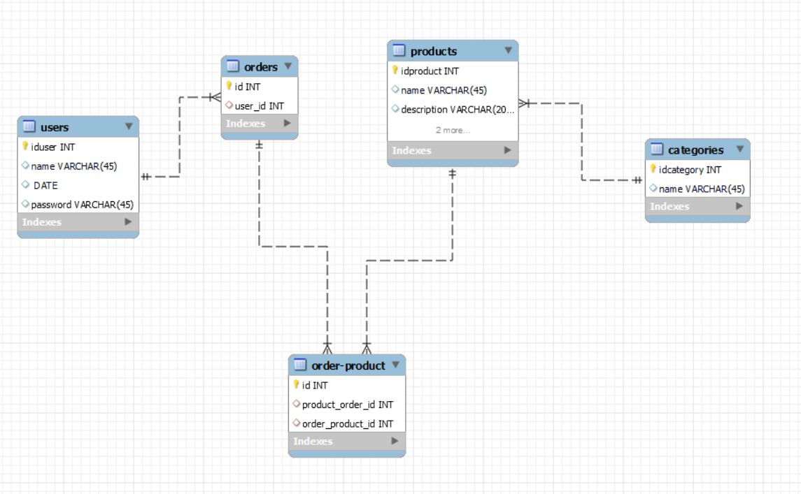

<h1>Building an Ecommerce Backend</h1>

<h3 align="center">With Node.js, Express and Sequelize</h3>

  <a><strong>Who an I</strong>
   
  ·
  <a href="https://github.com/apl09">Adrián Pastor</a>  
  >
  ·

## 📝 Project Description

I am trying in this project to create a functional Ecommerce Backend that, can work as a real one, beeing able to create, update, delete, and post products and users, also implementing a validation that the user has been loged or beeing admin so you can do certain things in the app. Also to be able to log in and log out to the page

## About the project

### 🎯 Objectives

<ol>
  <li><strong>Analyze</strong> NodeJS, Express and Sequelize</li>
  <li><strong>Experiment</strong> using this methods to build a Ecommerce Backend .</li>
  <li><strong>Optimize</strong> the user experience.</li>
  <li><strong>Integrate</strong> NodeJS to enhance interactivity.</li>
  <li><strong>Customize</strong> and adapt styles.</li>
</ol>

### 🔬 Methodology

<strong>Research and experimentation:</strong> i've gathered relevant information about  NodeJS, Express, and Sequelize from reliable sources. Then, we applied these concepts in examples and projects to explore the capabilities of Node. I compared and evaluated the results obtained in different contexts.

<strong>Practical experimentation:</strong> I created a development environment and carried out a series of examples and projects to apply the learned concepts and explore the capabilities of CRUD.

<strong>Analysis and comparison:</strong> I compared and evaluated the results obtained by using Sequelize to create tables with content in NodeJS

<strong>Documentation:</strong> I maintained a detailed record of our research process, including the steps followed, the problems encountered, and the implemented solutions.

## 🧠 Conclusions

In conclusion, this research project has allowed me to explore and deeply understand the potential of CRUD in combination with NodeJS to understand how the backend part of the website works. 

## 💻 Preview 
